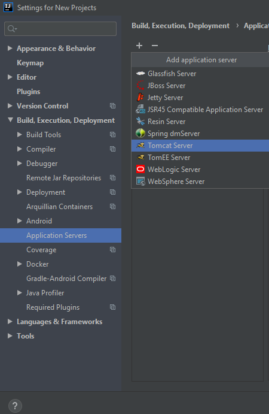
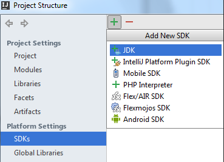
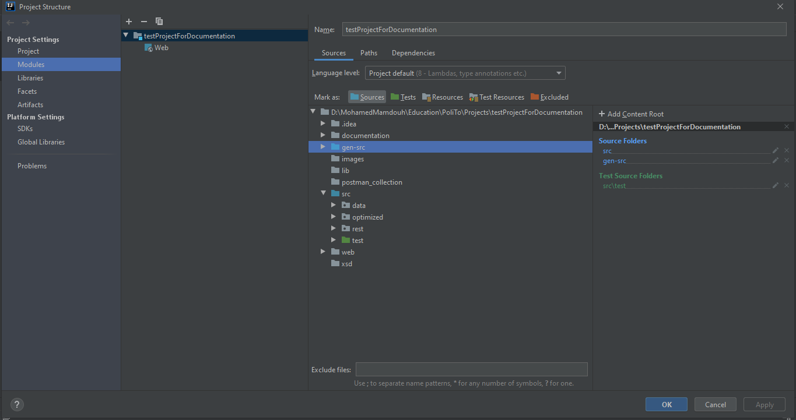

# Optimized-Firewall-Anomaly-Resolutions

Firewalls have been widely used to protect not only small and local networks, but also large enterprise networks. The configuration of firewalls is mainly done manually by network administrators. Thus, it suffers from human errors. A typical example of error in firewall configurations is conflict among two firewall rules, which arises when the effect of one rule is influenced or altered by another one, e.g. the actions of two rules (that are both satisfied simultaneously) contradict each other. In literature, several solutions have been proposed for firewall conflict detection. However, a detected conflict has to be solved manually by administrators, and none of the proposed approaches even tries to minimize such necessary administration operations. In order to overcome this limitation, the Netgroup (Computer Networks research group at Politecnico di Torino) recently defined a new approach, which also minimizes the number of resolutions that have to be performed by administrators to fix the detected conflicts. The aim of this project is to design and implement a RESTful web service based on this new approach.

# RESTful web service

Implementation of a RESTful web service that permits to create an optimizer which contains set of firewall rules and anomalies . 

Different methods allow you to get the list of updated set of rules after performing the desired optimization on the list of rules and anomalies. Check [Documentation](https://github.com/MohamedMamdouh95/Optimized-Firewall-Anomaly-Resolution/tree/master/documentation) for more information.

# Overview

- [Configuration](#configuration)
	- [IntelliJ IDEA](#intellij-IDEA)
	- [Eclipse](#Eclipse)
- [Postman Collection](https://github.com/MohamedMamdouh95/Optimized-Firewall-Anomaly-Resolution/tree/master/postman_collection)
- [Possible Issues](#Possible-Issues)

# Configuration

## IntelliJ IDEA

The used software has been [IntelliJ IDEA ULTIMATE EDITION](https://www.jetbrains.com/idea/).

### Before starting

- Download SE Development Kit (JDK), version 1.8, see [Download Oracle JDK](https://www.oracle.com/technetwork/java/javase/downloads/jdk8-downloads-2133151.html). Don't forget to add JAVA_HOME to the environmental variables.
- Download Tomcat server 9.0.33, see [Download Tomcat server](https://tomcat.apache.org/download-90.cgi). Don't forget to add CATALINA_HOME to the environmental variables which points to the installation directory of Tomcat.
- Download Apache Ant 1.9.x, see [Download Apache Ant](https://ant.apache.org/bindownload.cgi). Don't forget to add ANT_HOME to the environmental variables which points to the installation directory of Apache Ant.

### Configure the Tomcat server in IntelliJ IDEA

1. Open the *Settings / Preferences Dialog* choosing **File | Settings** for Windows and Linux or **IntelliJ IDEA | Preferences** for macOS, and click Application Servers under Build, Execution, Deployment.
2. On the **Application Servers** page that opens, click **+** icon choose **Tomcat Server** from the list.

3. Specify the **Tomcat Server** installation folder in the Tomcat Home field. Type its path manually or click browseButton and choose the installation folder in the dialog box that opens.

### Configure the JDK

1. Choose *File | Project Structure* on the main menu.
2. In the Project Structure Dialog that opens, choose **SDKs** under the **Platform Settings**.
3. On the **SDKs** page that opens, click **+** icons general add svg above the central pane and choose **JDK**.

4. Specify the installation folder of the **Java SE Development Kit (JDK)** to use. Type the path manually or click browseButton and choose the installation folder in the dialog that opens.

### Create Project

1. Click Create **New Project** on the Welcome screen, or choose *File | New | Project* on the main menu. The New Project wizard opens.
2. On the page of the Wizard:
    1. Select Java Enterprise.
    2. From the **Project SDK list**, select the **JDK 1.8**.
    3. From the **Application Server** drop-down list, choose **Tomcat 9.0.33**.
    4. From the **JavaEE Version** drop down list, choose **JavaEE 8**.
    5. In the Additional Libraries and Frameworks area, check **RESTful Web Service**/**JAX RESTful Web Services** checkboxes.
    6. Choose the **Download** option in the area below (the area is displayed only after you have selected RESTful Web Service checkbox.) Then click on **Configure** and uncheck all the files to download.
    7. In the Additional Libraries and Frameworks area also check **Web Application** checkbox.
    8. Click **Next**.
    9. Specify the name for your new project.
    10. Click **Finsh**.

Click Finish and wait while IntelliJ IDEA is creating the project.

### Import the project

1. Clone the project

        git clone https://github.com/MohamedMamdouh95/Optimized-Firewall-Anomaly-Resolution

2. Overwrite all the files and folders in the new project with the newly downloaded one.

3. Click on **File** select **Project Structure** then select **Project** and make sure that you chose a directory for the Compiler output. From the Project Setting menu, select **Module**, select **gen-src** mark it as Sources, select **test** inside src and mark it as **Tests**. You should have the same result as this

4. From the same Project Setting menu select **Libraries**, click on **+** sign and select java. Add both libraries folder you have in this project i.e (web/WEB-INF/lib) then click Apply.
5. Without closing the project structure window. select **Artifacts**. you should find a warning at the bottom of the window, click on **FIX** and select **Add 'lib' to the artifact** . Under the WEB-INF/classes directory create new Directory named *xsd*, After creating this directory select it and click on **+** and choose **Directory Content**. Select the *xsd* you copied into your projet. Before clicking ok make sure that you checked **Include in project build** option. The artifacts should look as the following picture. 

6. Open *web.xml* file, in the second servlet change the following line from
 `<param-value>http://localhost:8080/Optimized_Firewall_Anomaly_Resolution_war_exploded/rest</param-value>`
 to `<param-value>http://localhost:8080/testProjectForDocumentation_war_exploded/rest</param-value>`
 in my case the project name was *testProjectForDocumentation* your can replace this name with your project name **BUT DON'T REMOVE _war_exploded**.
 7. open index.jsp file and change the hyperlink the same way we did in point 6.

Now you can run the application.

File *build.xml* and *tomcat-build.xml* can be deleted (useful only for Eclipse configuration).

## Eclipse

The used software has been [Eclipse IDE for Enterprise Java Developers.](https://www.eclipse.org/downloads/packages/release/2020-03/r/eclipse-ide-enterprise-java-developers-includes-incubating-components)

### Create Project and configure Tomcat

1. Click *File > New > Other*.
2. On the page of the Wizard:
    1. Search for **Dynamic Web Project**.
    2. Set the **Project name**.
    3. On **Target runtime** select **Apache Tomcat v9.0**.
    4. Now browse the path of Tomcat home directory.
    5. From **Dynamic web module version** select **4.0**.
    6. Click **Finish**.
    
### Import the project

1. Clone the project

        git clone https://github.com/MohamedMamdouh95/Optimized-Firewall-Anomaly-Resolution
2. After clonining the project, before you copy the content of the cloned folder change the name of the *Web* folder to *WebContent*

3. Overwrite all the file folder of your project with the new one downloaded.
4. Right click on **gen-src** folder and select **use as source folder** from *Build Path*
5. Add the ant builders by clicking on *Window->Show View->Other->Ant* then add the two ant builders (builder.xml & tomcat-build.xml)
6. Open the build.xml and change the following things:
    - project name to your project name
    - change the property *name* value to your project name
    - open web.xml and change the following line from `<param-value>http://localhost:8080/Optimized_Firewall_Anomaly_Resolution_war_exploded/rest</param-value>` to `<param-value>http://localhost:8080/PUT YOUR PROJECT NAME HERE/rest</param-value>`
    - open index.jsp and change the following line from `
<a href="_swagger-ui/index.html?url=http://localhost:8080/Optimized_Firewall_Anomaly_Resolution_war_exploded/rest/swagger.json">Swagger documentation</a>` to `
<a href="_swagger-ui/index.html?url=http://localhost:8080/PUT YOUR PROJET NAME HERE/rest/swagger.json">Swagger documentation</a>`

7. At this point you can:
	- Use the **build.xml**
		- Target: start-tomcat
		- Target: deploy
		- Now the services has been deployed and ready to use
        - open google chrome and enter the following link `http://localhost:8080/PUT YPUR PROJECT NAME/` you should get the index screen.

# Postman Collection

The postman folder contains a .json file (that can be imported in Postman) wich inside are defined some GET, POST, DELETE and PUT examples for some elements.

# Possible Issues

- Tomcat might refuse your connection. If so open Tomcat setup folder then open *conf->tomcat-user.xml* add the following line
`  <user username="root" password="root" roles="admin-gui,admin-script,manager-gui,manager-script"/>
`
